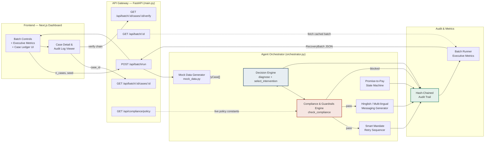
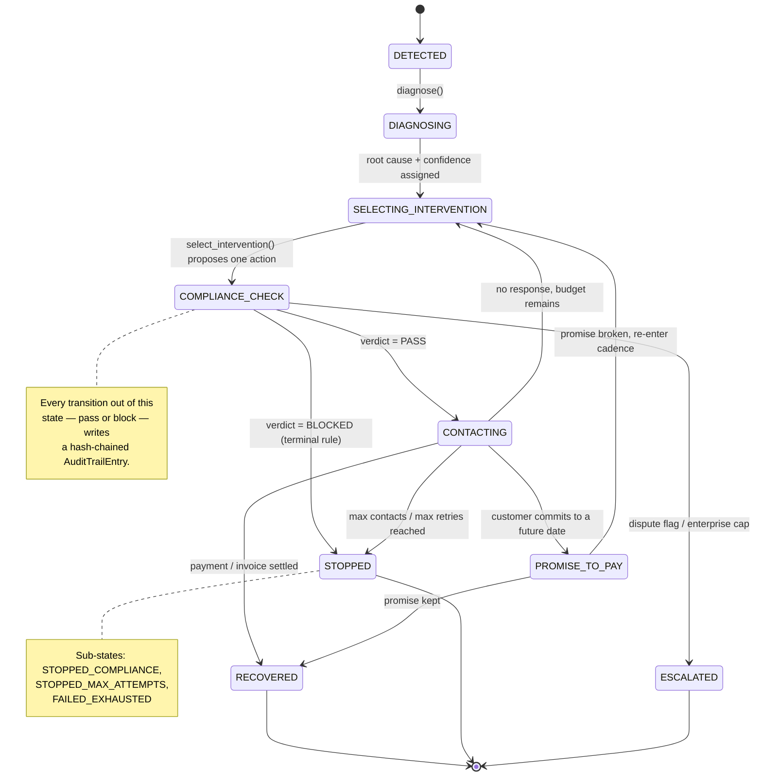
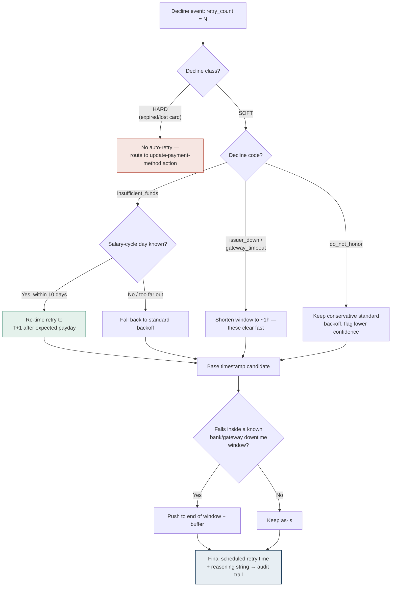
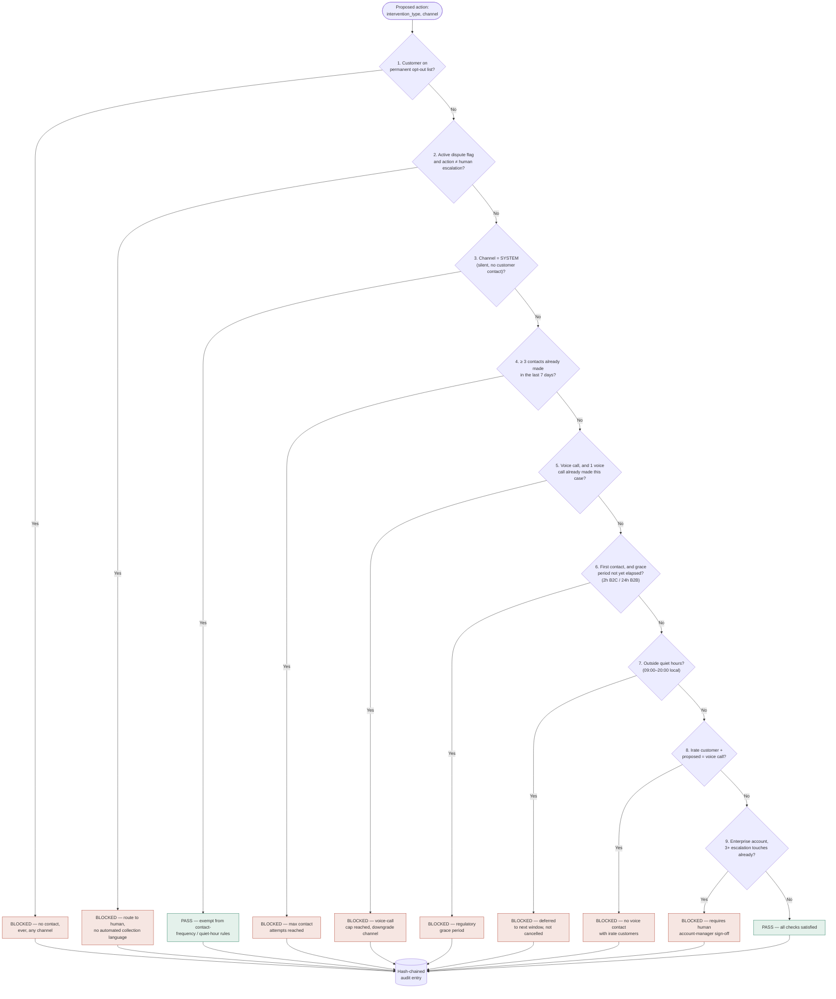
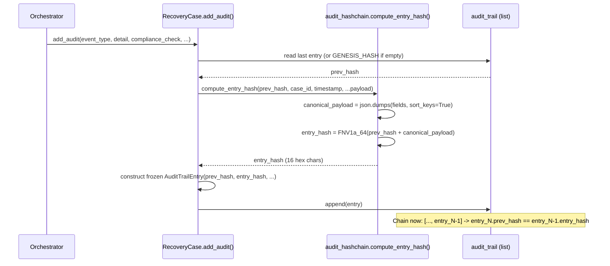

# Ledger — AI Revenue Recovery Agent
## System Architecture Document

**Track 03: AI Revenue Recovery**
**Version 1.0**

---

## 1. Executive Summary & Track Alignment

Ledger is a bounded, auditable AI agent that detects revenue at risk, diagnoses its root cause,
selects a compliant intervention, and executes recovery across four distinct scenarios: failed
subscription payments, abandoned checkouts, overdue B2B receivables, and payment-gateway
degradation. The system is architected as two decoupled services — a **FastAPI backend** that
contains the entire agent, and a **Next.js dashboard** that runs simulated batches against it and
visualizes the outcome — connected by a versioned REST contract.

The architecture is deliberately built around four non-negotiable properties, each mapping
directly to a Track 03 judging metric:

| Judging Metric | Architectural Mechanism |
|---|---|
| **Measured money recovered** ($/₹ total & recovery rate %) | Every case resolves to a terminal state with an explicit `amount_recovered` field; `batch_runner.py` aggregates this across the batch into `total_recovered` and `recovery_rate_pct`, computed from real per-case outcomes rather than a static assumption. |
| **Compliant escalation matrix** | `decision_engine.select_intervention()` implements a graduated matrix — cadence intensifies attempt-over-attempt (silent retry → SMS → voice/email → discount) and **automatically de-escalates** for irate, premium, or enterprise customers. |
| **Strict stopping rules & guardrails** | `compliance.py` is a single mandatory gate that every customer-facing action must pass through before execution — opt-outs, dispute flags, contact-frequency caps, quiet hours, and instant-termination keywords are all enforced here, with zero bypass paths. |
| **Immutable, tamper-evident audit trail** | Every diagnosis, compliance check, intervention, and P2P event writes a frozen `AuditTrailEntry`, and each entry is cryptographically chained to the one before it (Section 5), so the *sequence* of the log — not just each record — is verifiable. |

Critically, the money-moving and compliance decision logic is **deterministic**, not an LLM call.
This is a deliberate architectural choice, discussed in depth in Section 4.1, made in service of
reproducibility and auditability rather than generative flexibility.

---

## 2. High-Level System Architecture

### 2.1 Decoupled Service Design

The backend and frontend are independently deployable services communicating over HTTP/JSON:

- **Backend (Python / FastAPI)** owns all domain logic: mock data generation, diagnosis,
  compliance, retry sequencing, localized messaging, the state machine orchestrator, and the
  audit trail. It is stateless between requests except for an in-memory batch store (a deliberate
  simplification for the prototype — see Section 6).
- **Frontend (Next.js, App Router)** is a thin, read-mostly control panel. It triggers batch runs,
  polls the resulting `RecoveryBatch` JSON, and renders it — the dashboard performs no business
  logic of its own. `lib/types.ts` mirrors `backend/app/models.py` field-for-field so there is no
  translation layer between what the agent decided and what is displayed.

This separation means the entire agent can be exercised, tested, and audited via `curl`/`pytest`
with no UI involved, and the UI can be replaced or extended (e.g. a real-time ops console) without
touching a single line of decision logic.

### 2.2 Component Flow Diagram



**Read of the diagram:** the Mock Data Generator is the only source of new cases (standing in for
a real webhook/event stream in production — see Section 6). Every case then flows through
Diagnosis and, critically, **through the Compliance Gate before either the Retry Sequencer or the
Messaging Generator can act** — a blocked verdict routes directly to the Audit Trail without ever
reaching a customer-facing module. All five paths converge on the hash-chained Audit Trail, which
the Batch Runner then aggregates into the executive metrics the dashboard displays.

---

## 3. The Agent Pipeline & State Machine

### 3.1 Case Lifecycle

Every `RecoveryCase` advances through a linear detection/diagnosis phase and then a
compliance-gated action loop that terminates in exactly one of five terminal states:

```
DETECTED → DIAGNOSING → SELECTING_INTERVENTION → COMPLIANCE_CHECK → (CONTACTING | STOPPED | ESCALATED)
```

- `DETECTED` — an at-risk revenue event has been ingested (from `mock_data.py` in this prototype;
  from a payment-gateway or CRM webhook in production).
- `DIAGNOSING` — `decision_engine.diagnose()` maps the transaction's scenario and decline code to
  a `RootCause` with a confidence score and a human-readable reasoning string.
- `SELECTING_INTERVENTION` — `decision_engine.select_intervention()` runs the escalation matrix
  against the diagnosis, the customer's segment/language/irate flag, and how many contacts have
  already been made, producing exactly one proposed action.
- `COMPLIANCE_CHECK` — `compliance.check_compliance()` evaluates the proposed action against
  eight ordered guardrail rules (Section 4.3). This is the only branch point in the entire
  pipeline: every other module is a straight-line function.
- Terminal branches:
  - **CONTACTING** → the action executes (message sent, retry scheduled, or silent system retry)
    and the case either resolves (`RECOVERED`), enters `PROMISE_TO_PAY`, or loops back to
    `SELECTING_INTERVENTION` for the next attempt.
  - **STOPPED** → a guardrail blocked the action permanently for this case
    (`STOPPED_COMPLIANCE`) or the contact/retry budget was exhausted
    (`STOPPED_MAX_ATTEMPTS` / `FAILED_EXHAUSTED`).
  - **ESCALATED** → routed to a human (`ESCALATED_HUMAN`) — used for active disputes and
    enterprise accounts past the automated-collections threshold.

### 3.2 State Diagram



### 3.3 Implementation Mapping

| State (conceptual) | Backend implementation |
|---|---|
| `DETECTED` | `orchestrator.run_case_to_completion()` writes the initial `"detected"` audit entry |
| `DIAGNOSING` | `orchestrator.run_diagnosis_step()` → `decision_engine.diagnose()` |
| `SELECTING_INTERVENTION` | `decision_engine.select_intervention()`, called inside `orchestrator.run_contact_step()` |
| `COMPLIANCE_CHECK` | `compliance.check_compliance()` — the mandatory gate |
| `CONTACTING` | `CaseStatus.CONTACTED`; message built by `messaging.generate_message()`, timing by `retry_sequencer.predict_retry_window()` where applicable |
| `STOPPED` | `CaseStatus.STOPPED_COMPLIANCE` / `STOPPED_MAX_ATTEMPTS` / `FAILED_EXHAUSTED` |
| `ESCALATED` | `CaseStatus.ESCALATED_HUMAN` |

---

## 4. Core Modules Deep Dive

### 4.1 Deterministic Decision Engine — Why Not an LLM?

Both `decision_engine.diagnose()` and `decision_engine.select_intervention()` are **pure,
deterministic functions**: given the same case state, they return the same root cause and the
same intervention, every time, with no sampling and no external call. This is a load-bearing
architectural decision, not an oversight:

- **Reproducibility.** A judge, auditor, or regulator must be able to re-run a case and get the
  identical decision. A non-deterministic model (even at temperature 0, across provider versions)
  cannot make that guarantee; a rule engine can, trivially.
- **Auditability.** Every branch in `select_intervention()` is a named, inspectable `if`/`elif`
  with an attached `reasoning` string. There is no hidden weight matrix standing between "customer
  is irate" and "downgrade to email" — the causal path is the source code itself.
- **Eliminating hallucination risk on money-moving actions.** An LLM asked to "decide the next
  collection action" can, in principle, invent a discount percentage, misstate a regulatory grace
  period, or apply a rule it wasn't given. A deterministic engine cannot hallucinate a rule that
  isn't in `compliance.py` — it can only execute the rules that are.
- **Testability.** Because the functions are pure, the entire decision surface is unit-testable
  with fixed inputs and exact-match assertions, which is how the guardrail edge cases (Section 4.3)
  are verified in this build.

This does **not** mean generative AI has no place in the system. `messaging.py` is the natural
integration point for an LLM to make message *phrasing* more dynamic while the *decision* of
which intervention to send, in which language, on which channel, remains the deterministic
engine's output — keeping the generative surface confined to language, never to compliance or
money movement.

### 4.2 Smart Mandate Retry Sequencer

`retry_sequencer.predict_retry_window()` computes the optimal next retry timestamp for a soft
decline by layering three signals on top of a bounded backoff schedule:



**Backoff schedule** (`BASE_BACKOFF_HOURS`): `4h → 24h → 72h → 168h`, indexed by
`transaction.retry_count` and hard-capped at four attempts — the sequencer never proposes a fifth
automated retry.

**Salary-cycle alignment**: for `insufficient_funds` declines where the customer's
`salary_cycle_day` is known, the sequencer computes the nearest upcoming date matching that day,
biased **T+1** (funds typically clear same-day, but payroll processing queues make T+1 the safer
retry point), and substitutes it for the flat backoff — but only if doing so doesn't delay the
retry by more than 10 days versus the standard schedule, to avoid trading a fast recoverable case
for an unnecessarily long wait.

**Bank/gateway downtime avoidance**: candidate timestamps are checked against known
maintenance windows (nightly settlement batches, NEFT/RTGS windows) and pushed to the end of the
window plus a small buffer if they land inside one.

Every prediction returns a `reasoning` string that is written directly into the hash-chained
audit trail — nothing is ever scheduled silently.

### 4.3 Compliance & Guardrails Engine

`compliance.check_compliance()` is invoked once per proposed action and evaluates rules **in a
fixed order**, short-circuiting on the first block:



**Instant-termination keyword scanning** operates independently of this ordered chain:
`compliance.scan_for_termination_keywords()` inspects any inbound customer text (an SMS/email
reply, or a voice-call transcript) for a fixed set of trigger phrases — `stop`, `unsubscribe`,
`lawyer`, `attorney`, `dispute`, `fraud`, `harassment`, `complaint`, `police`, and others — and, on
a match, permanently suspends all further automated contact for that case, writing a `BLOCKED`
audit entry that references the specific rule (`instant_termination_keyword`) without echoing
the customer's raw message back into the log verbatim.

A **blocked verdict is correct behavior, not a system failure.** It is logged with exactly the
same rigor as a passed check, and the batch-level "audit compliance rate" (Section 5) measures
that every single action — passed or blocked — went through this gate, not that every action
succeeded.

---

## 5. Immutable Audit Trail (Cryptographic Hash-Chaining)

### 5.1 Why Immutability at the Object Level Isn't Enough

`AuditTrailEntry` is a Pydantic model declared with `class Config: frozen = True` — once
constructed, none of its fields can be reassigned; any attempt raises a `TypeError` at the
Python level. This guarantees a **single record** can't be edited in place. It does **not**,
by itself, guarantee that the *sequence* of records is trustworthy: a record could still be
deleted from the list, two records could be reordered, or a record could be reconstructed from
scratch with altered content and substituted in — none of which "frozen" alone would catch.

To close that gap, Ledger chains every entry to the one before it.

### 5.2 The Chaining Mechanism

Implemented in `backend/app/audit_hashchain.py`. Each `AuditTrailEntry` carries two additional
fields, computed at construction time and never touched again:

- **`prev_hash`** — the `entry_hash` of the previous entry in this case's audit trail, or a fixed
  16-character `GENESIS_HASH` (`"0000000000000000"`) if this is the first entry for the case.
- **`entry_hash`** — `FNV1a_64(prev_hash + canonical_payload)`, hex-encoded to 16 characters.

```python
GENESIS_HASH = "0" * 16

def compute_entry_hash(prev_hash: str, **payload_fields) -> str:
    payload = canonical_payload(**payload_fields)      # json.dumps(..., sort_keys=True)
    combined = (prev_hash + payload).encode("utf-8")
    return format(fnv1a_64(combined), "016x")
```

The `canonical_payload` covers `case_id`, `timestamp`, `actor`, `event_type`, `detail`,
`compliance_check`, `compliance_rule`, and `data_snapshot`, serialized with `sort_keys=True` so
that the same logical content always produces the same bytes regardless of dict insertion order.
`RecoveryCase.add_audit()` is the **only** method that constructs an `AuditTrailEntry`, and it
always looks up `prev_hash` from `self.audit_trail[-1].entry_hash` before computing the new hash
— so the chain is built automatically, in order, as a natural side effect of normal operation.
There is no code path that can append an entry without extending the chain correctly.

### 5.3 Why FNV-1a, and What This Mechanism Is (and Isn't) For

FNV-1a (Fowler–Noll–Vo) is used rather than SHA-256 deliberately: it is fast, has zero external
dependencies, and is entirely sufficient for this mechanism's actual job — **tamper-evidence**,
not **cryptographic-security against a sophisticated adversary with write access to the
datastore**. This audit log is single-agent and append-only by construction; the hash chain's
purpose is to give a fast, structural integrity check that surfaces accidental corruption,
reordering, or naive post-hoc editing, and to give the dashboard a genuine "Verify" action to run
rather than a decorative badge. For a production deployment defending against a malicious insider
with database access, the recommendation in Section 6 is to move this same chaining pattern to a
cryptographic hash (SHA-256/HMAC) at the persistence layer, ideally combined with a write-once
storage engine.

### 5.4 Verification

`audit_hashchain.verify_chain()` walks a case's `audit_trail` from the beginning, recomputing
each `entry_hash` from scratch and confirming both that it matches the stored value and that each
entry's `prev_hash` correctly equals the previous entry's `entry_hash`. It returns the exact index
at which the chain first breaks, if it does — this is not a boolean sanity check, it's a
diagnostic tool.

This is exposed as a live API endpoint, not just an internal utility:

```
GET /api/batch/{batch_id}/cases/{case_id}/verify
```

```json
{
  "case_id": "case_77dd8e3bf8",
  "valid": true,
  "entries_checked": 10,
  "first_break_index": null,
  "detail": "All 10 audit entries verified: hash chain intact, no reordering or tampering detected."
}
```

The dashboard's Case Detail panel includes a **"Verify hash chain"** button that calls this
endpoint live and renders the result — and the panel also prints each entry's `entry_hash` and
`prev_hash` (truncated) directly in the timeline, so the chain is visible, not just claimed.

**Tamper-detection was validated directly**, not just asserted: constructing a clean 5-entry chain
and then (a) mutating one entry's `detail` field and (b) swapping the order of two entries were
both tested against `verify_chain()`. Both cases were caught precisely:

```
CLEAN VERIFY     -> True  · All 5 audit entries verified: hash chain intact, ...
TAMPERED VERIFY  -> False · Entry 1 hash mismatch: stored '6c3e58c1f1027a1d',
                            recomputed '12464b38b794dff3'. Its content was altered
                            after being written.
REORDERED VERIFY -> False · Entry 1 has prev_hash '6c3e58c1f1027a1d' but the chain
                            expected 'b672a072563d36d4'. The sequence has been
                            reordered, or an entry was deleted.
```

### 5.5 Sequence Diagram — Writing a Chained Entry



---

## 6. Path to Production (Hardening Roadmap)

The current build is an intentionally scoped hackathon prototype. The items below are the
concrete next steps to take it to a production-grade system, in priority order.

### 6.1 Persistence: In-Memory → PostgreSQL, Write-Once / Append-Only

- Replace `main.py`'s `_BATCH_STORE` dict with a Postgres-backed repository layer.
- The `audit_trail` table should be **append-only at the database level**, not just by
  application convention: revoke `UPDATE` and `DELETE` grants on that table for the application
  role, so tampering would require a privileged DBA action, not a bug in the app code.
- Store `prev_hash`/`entry_hash` as indexed columns so `verify_chain()`'s logic can run as a SQL
  window-function query across an entire case (or entire batch) without loading every row into
  application memory first.
- Periodically snapshot the last `entry_hash` per case to an external, independently-controlled
  store (e.g. a separate audit-only service, or a public timestamping service) — this closes the
  remaining gap where an attacker with full database access could rewrite an entire chain
  consistently from the genesis hash forward.

### 6.2 Real Payment & Communication Integration

- Replace `orchestrator._simulate_outcome()` with real Razorpay/Stripe webhook listeners
  (`payment.captured`, `payment.failed`, `invoice.paid`) that transition cases based on actual
  gateway events instead of a weighted random draw.
- Wire `messaging.py`'s send actions to real SMS/email/voice providers, and route their delivery
  and inbound-reply webhooks into `compliance.scan_for_termination_keywords()` so a real customer
  reply of "stop" halts the case within one webhook round-trip.
- Replace the `mock_data.py` generator with a real event ingestion pipeline (subscription-billing
  webhooks, checkout-abandonment pixel events, AR-aging exports from the ERP).

### 6.3 Compliance Policy as a Configuration Microservice

- Move the constants currently hardcoded in `compliance.py` (`MAX_CONTACTS_PER_WINDOW`,
  `QUIET_HOURS_START/END`, grace periods, the termination-keyword list) into a versioned
  configuration service that legal/compliance teams can update without a code deployment.
- Every policy version should itself be hash-chained and timestamped, so "which ruleset was in
  force when this action was taken" is answerable for any historical case — extending the same
  tamper-evidence principle from Section 5 to the policy layer, not just the action layer.
- Add per-jurisdiction policy sets (contact-window and grace-period rules vary meaningfully
  between, e.g., India's IRDAI/RBI-adjacent norms and the US FDCPA) selected by customer
  geography at diagnosis time.

### 6.4 Operational Hardening

- Authentication and per-tenant data isolation before any real customer PII flows through the
  system.
- Move the FNV-1a chain to SHA-256/HMAC-SHA256 at the persistence layer for a genuine
  cryptographic-security boundary (Section 5.3), keeping FNV-1a only as the fast client-side
  sanity check the dashboard already performs.
- Replace the synchronous batch-run endpoint with an async job queue + webhook/SSE progress
  stream, so batch size is no longer bounded by a single HTTP request's timeout.
